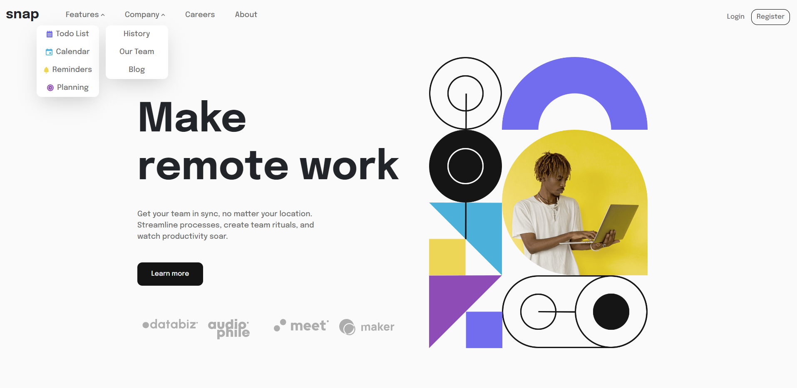
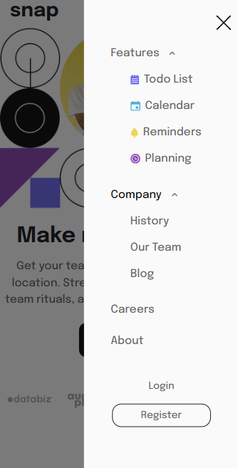

# Frontend Mentor - Intro section with dropdown navigation solution

## Table of contents

- [Overview](#overview)
  - [The challenge](#the-challenge)
  - [Screenshot](#screenshot)
  - [Links](#links)
- [My process](#my-process)
  - [Built with](#built-with)
- [Author](#author)

## Overview

### The challenge

Users should be able to:

- View the relevant dropdown menus on desktop and mobile when interacting with the navigation links
- View the optimal layout for the content depending on their device's screen size
- See hover states for all interactive elements on the page

### Screenshot

### Links

- Solution URL: [GitHub Repository](https://github.com/nicolozibra1/intro-dropdown-navigation)
- Live Site URL: [Coming Soon](https://your-live-site-url.com)

## My process

### Built with

- HTML5
- CSS3
- Sass
- Bootstrap (Mobile-first workflow)
- [Vue.js](https://vuejs.org/) - JS Framework
- [Vite](https://vitejs.dev/) - Frontend Tooling
## Author

- Website - [Coming Soon](#)
- Frontend Mentor - [@nicolozibra1](https://www.frontendmentor.io/profile/nicolozibra1)

